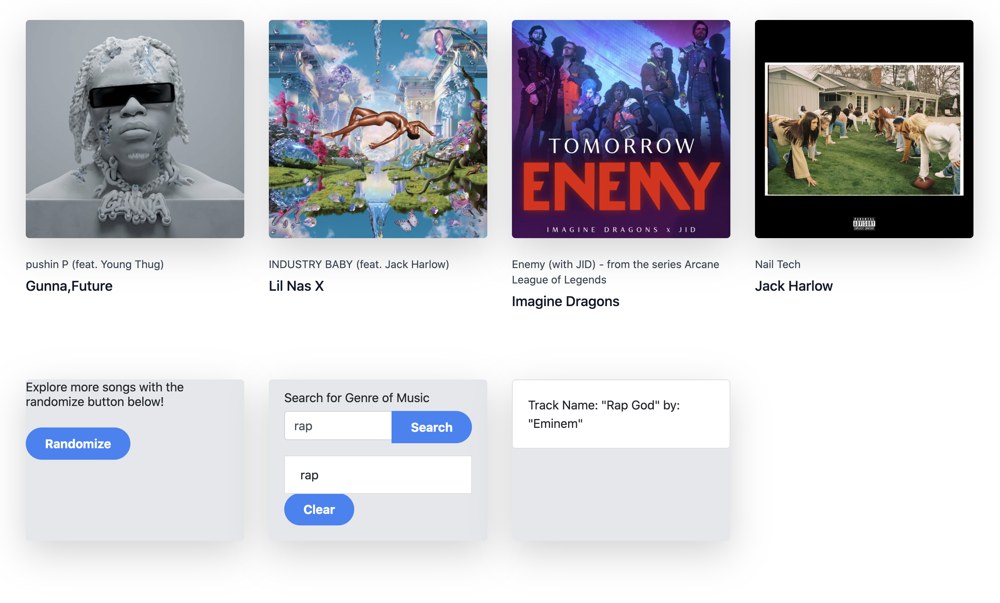
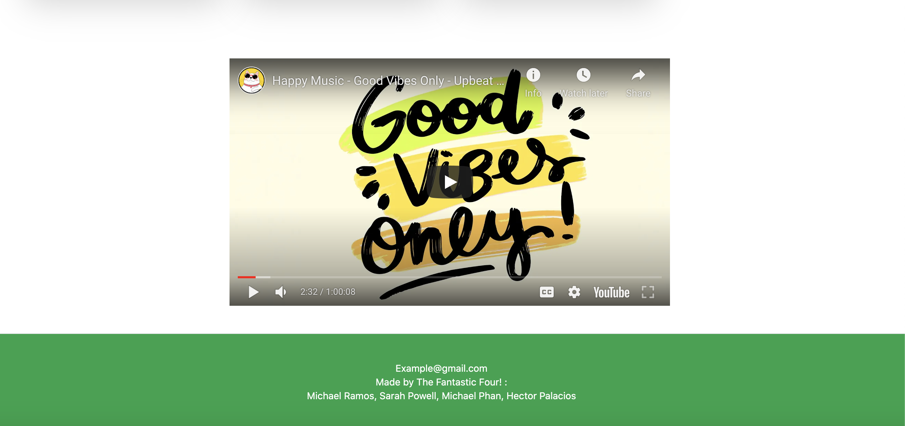

# now-spinning-team-4

## Installation

An application that will run in the browser and feature dynamically updated. Application features polished UI and is responsive, ensuring adaptation to multiple screen sizes.

 To build this webpage we used:
    - HTML 
    - Tailwind CSS 
    - Javascript 
    - Spotify API
    - YouTube API 
    - Images

## About this Webpage

    Now Spinning is a webpage designed to bring you the newest music releases, showcasing the artist name and song title along with their album artwork, plus a link to check out even more hits. We also have a little theme music going in the background while you browse new music hits. It is played using YouTube where you can click the video and be taken directly to YouTube to watch official music videos if you wish. YouTube has a copyright on their official music videos so we were unable to add them to our web application. 

## User Story

AS A user I will be able to view a responsive site
AS a music fan I WANT to find new music easily in one place
WHEN I click on song I WANT to be redirected in a new tab
WHEN I view music I WANT so see album aet work displayed
WHEN I search for a new genre I WANT a new music track to be displayed
WHEN I click on a video I WANT music to play

## Contributors

Sarah Powell, Micheal Ramos, Michael Phan, Hector Palacios 
    
## Screenshots

This image shows the header, navigation, banner and music section.

This image shows the interactive component.

This image shows the youtube video pulled via API and footer.

### Links    
Deployed link: https://michaelr432.github.io/now-spinning-team-4/ 

Github link: https://github.com/MichaelR432/now-spinning-team-4